# Jarkom-Modul-1-A07-2022

## Abggota Kelompok

- I Putu Bagus Adhi Pradana (5025201010)
- Izzati Mukhammad (5025201075)
- Muhammad Damas Abhirama (5025201271)

## Nomor 1
Sebutkan web server yang digunakan pada "monta.if.its.ac.id"! 

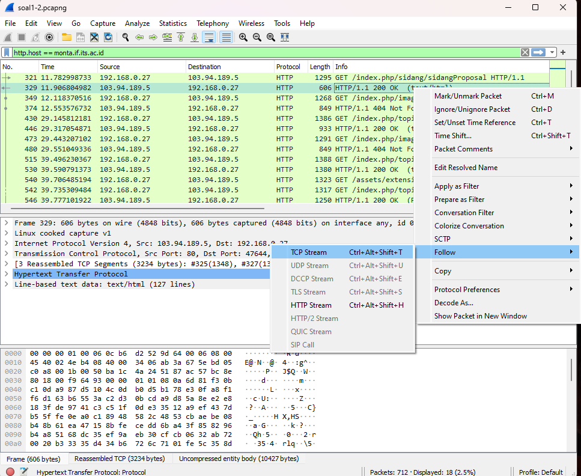
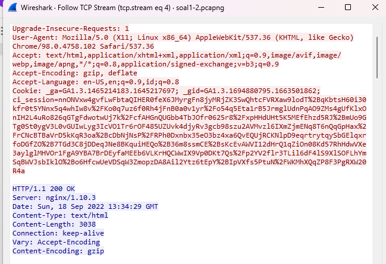

- Pertama mengisi display filter dengan : `http.host == monta.if.its.ac.id`
- Dengan melakukan Follow kemudian TCP Stream, maka bisa dilihat server yang digunakan adalah  nginx/1.10.3

## Nomor 2
Ishaq sedang bingung mencari topik ta untuk semester ini , lalu ia datang ke website monta dan menemukan detail topik pada website “monta.if.its.ac.id” , judul TA apa yang dibuka oleh ishaq ?

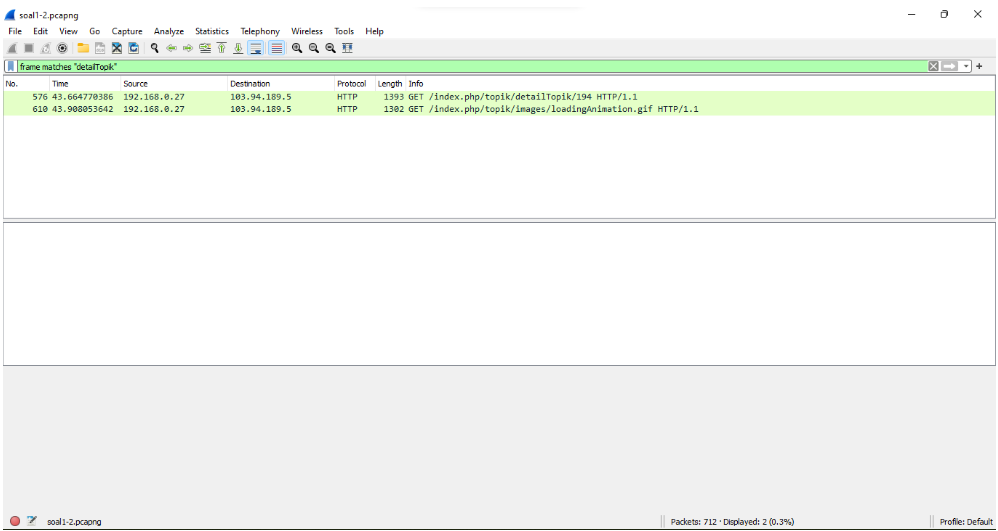
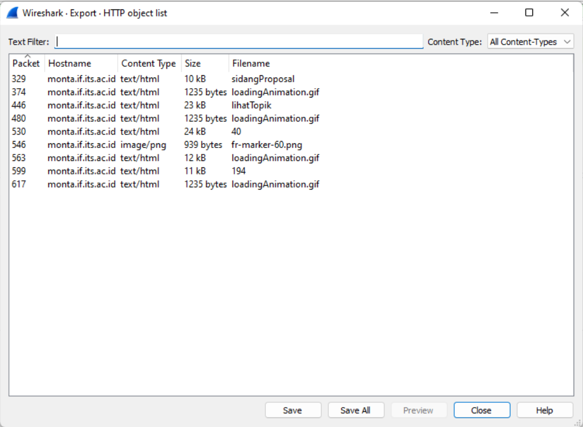

- Dengan mengisi display filter dengan `frame matches "detailTopik"`
- Kemudian melakukan eksport object http pada file lihatTopik, kemudian setelah dieksport dapat dilihat beberapa detail topik ta yang ishaq temukan yaitu,
  - Deteksi Sentimen pada Data Audio
  - Prediksi Produk Belanja
  - Cloud Provisioning dengan menggunakan OBL dan FSO
  - Cloud Resource Provisioning with Scheduling System
  - Cloud Provisioning dengan menggunakan GA-ANN

## Nomor 3
Filter sehingga wireshark hanya menampilkan paket yang menuju port 80! 

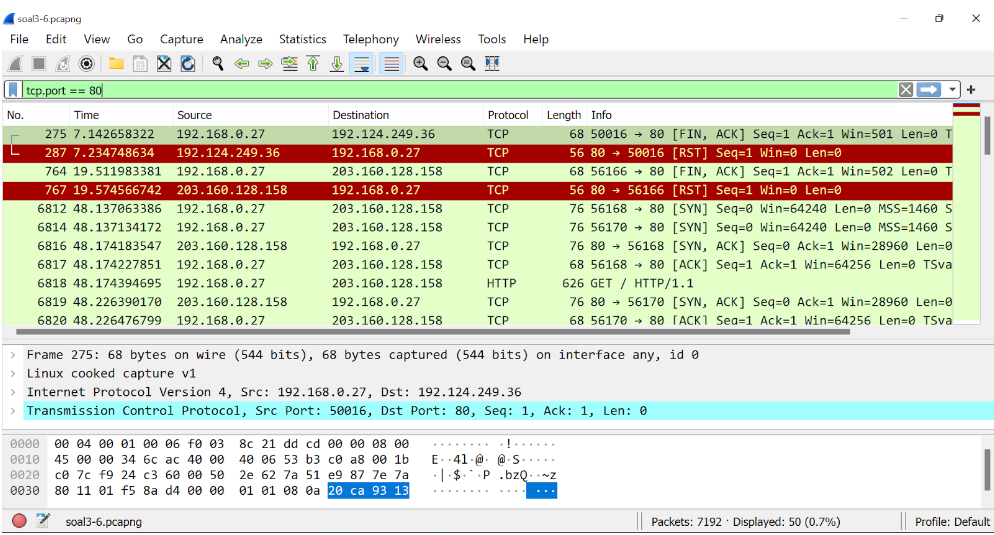

- Dengan membuka file soal3-6.pcapng, kemudian mengisi `tcp.port == 80` pada display filter

## Nomor 4
Filter sehingga wireshark hanya mengambil paket yang berasal dari port 21!

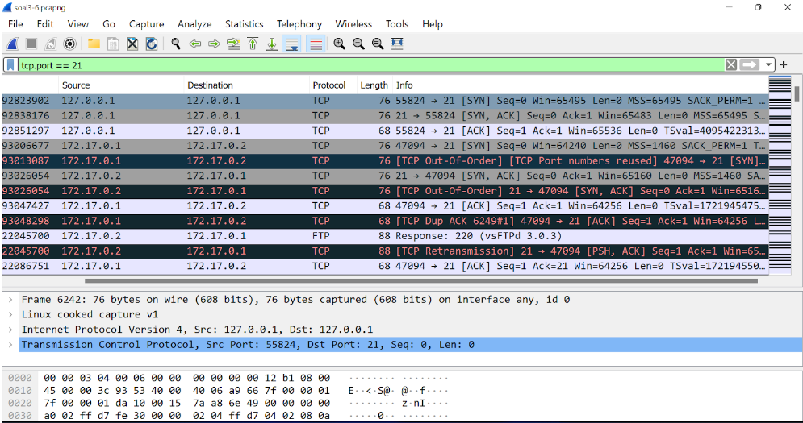

- Dengan membuka file soal3-6.pcapng, kemudian mengisi `tcp.port == 21` pada display filter

## Nomor 5
Filter sehingga wireshark hanya mengambil paket yang berasal dari port 443!

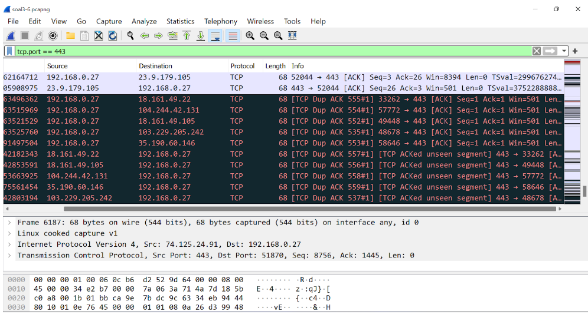

- Dengan membuka file soal3-6.pcapng, kemudian mengisi `tcp.port == 443` pada display filter

## Nomor 6
Filter sehingga wireshark hanya menampilkan paket yang menuju ke lipi.go.id !

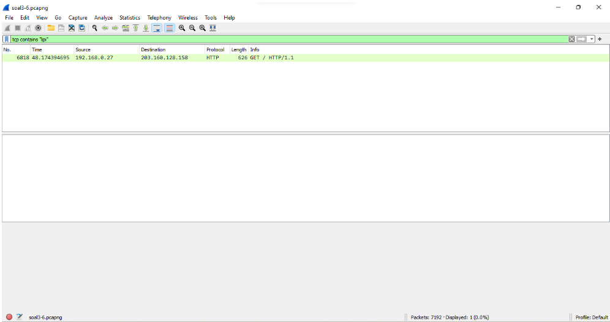

- Dengan mengisi display filter dengan : `tcp contains "lipi"`

## Nomor 7
Filter sehingga wireshark hanya mengambil paket yang berasal dari ip kalian!

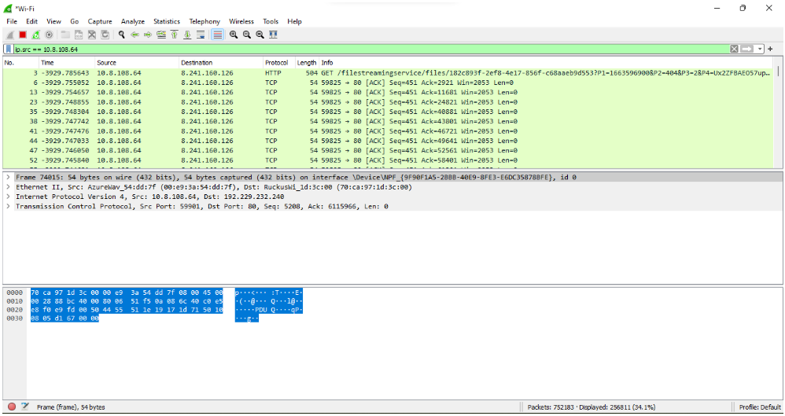

- Pertama kita perlu mengetahui ip kita sendiri dengan membuka cmd lalu `ipconfig`
- Setelah ip didapatkan kemudian memasukan `ip.src == 10.8.108.64` pada dsiplay filter dengan 10.8.108.64 merupakan ip kita sendiri

## Nomor 8
Telusuri aliran paket dalam file .pcap yang diberikan, cari informasi berguna berupa percakapan antara dua mahasiswa terkait tindakan kecurangan pada kegiatan praktikum. Percakapan tersebut dilaporkan menggunakan protokol jaringan dengan tingkat keandalan yang tinggi dalam pertukaran datanya sehingga kalian perlu menerapkan filter dengan protokol yang tersebut.

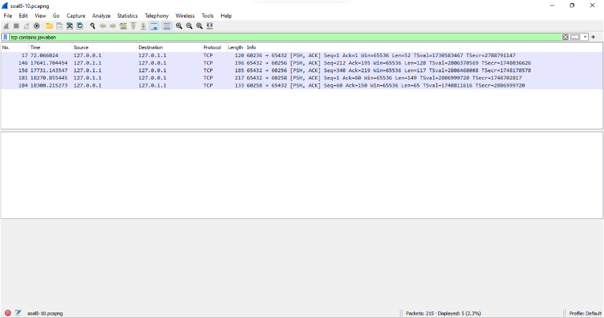
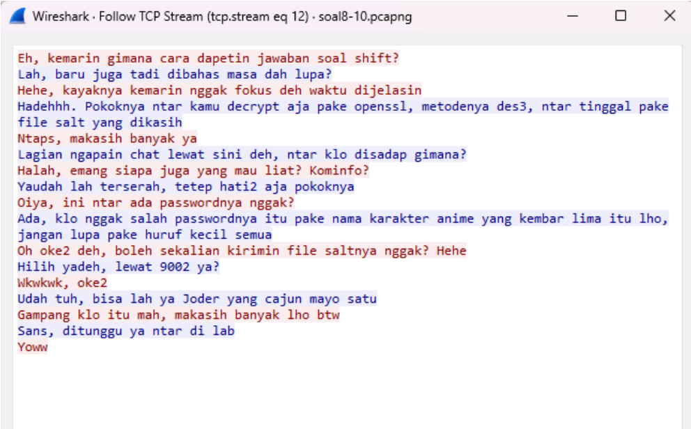

- Pertama mengisi display filter dengan : `tcp contains jawaban`
- Dengan melakukan Follow kemudian TCP Stream, maka kita dapat melihat percakapan yang terjadi

## Nomor 9
Terdapat laporan adanya pertukaran file yang dilakukan oleh kedua mahasiswa dalam percakapan yang diperoleh, carilah file yang dimaksud! Untuk memudahkan laporan kepada atasan, beri nama file yang ditemukan dengan format [nama_kelompok].des3 dan simpan output file dengan nama “flag.txt”.

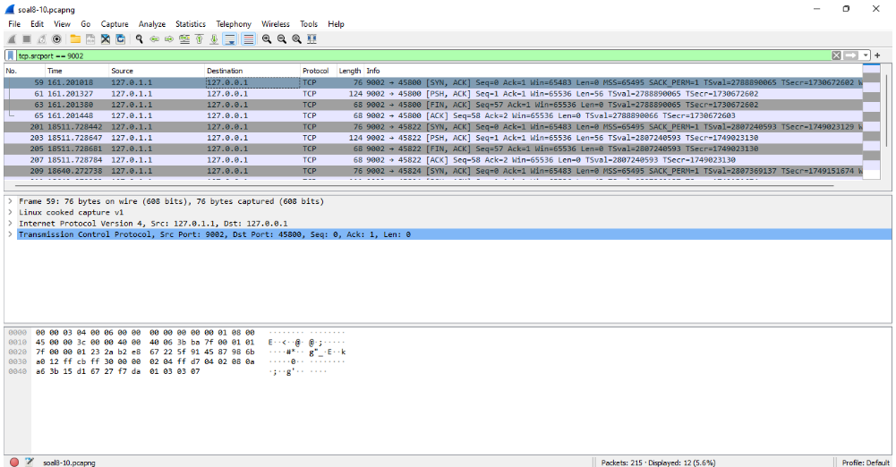
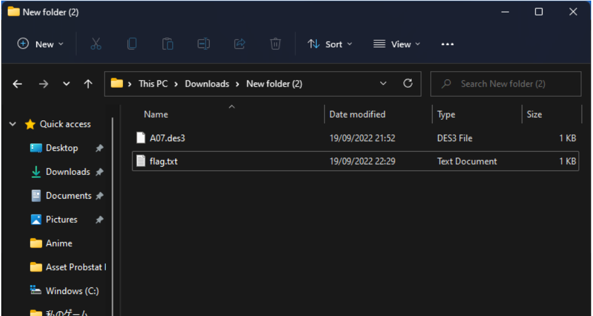

- dengan mengisi display filter dengan `tcp.srcport == 9002`
- Port 9002 karena pada percakapan yang ditemukan pada nomor 8 pertukaran jawaban melewati 9002
- kemudian dengan melakukan follw, TCP stream dan melakuakn save file dengan format A07.des3 dan output file dengan nama flag.txt

## Nomor 10
Temukan password rahasia (flag) dari organisasi bawah tanah yang disebutkan di atas!

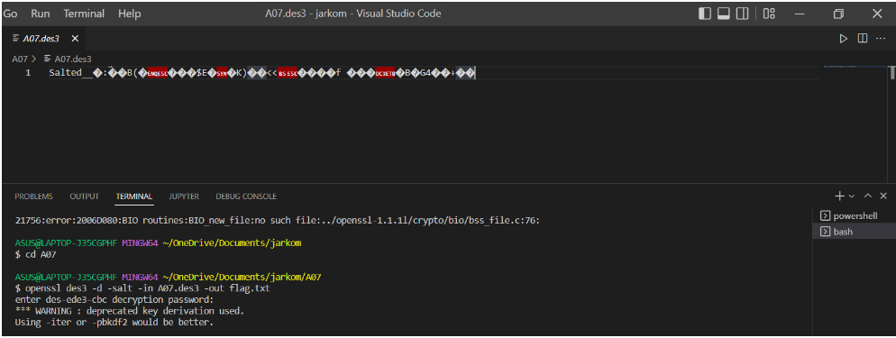
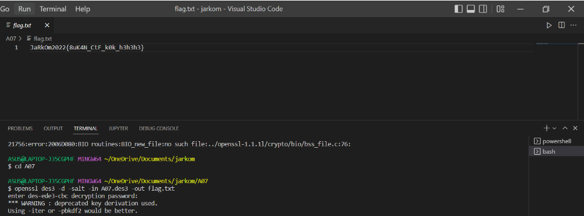

- Dengan membuka file A07.des3 kemudian mengisikan command `openssl des3 -d -salt -in A07.des3 -out flag.txt` pada terminal, dengan password yang ditemuakn adalah `"nakano"`
- Setelah itu kita dapat melihat flag pada file flag.txt
